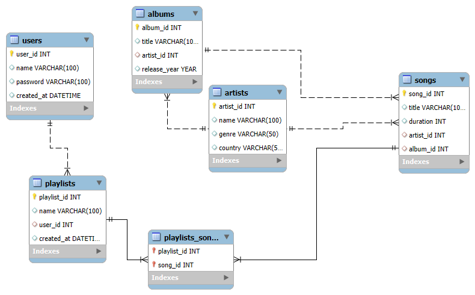

# Day01_music_app_database
Database schema and ER diagram for a Music App created using MySQL Workbench
# 🎵 Music App Database Project

## Overview
This project was created as part of my internship task on **Database Setup and Schema Design**. It is focused on concepts like DDL,Normalization and Relationships.  
I designed a relational database model for a *music streaming application* that allows users to create playlists, browse artists, and explore songs and albums.  
The goal was to learn how to design, normalize, and implement a structured database using **MySQL Workbench**.

---

## Database Design
The database consists of six main entities:

| Table | Description |
|--------|--------------|
| **Users** | Stores user account details and registration info |
| **Artists** | Information about artists including name, genre, and country |
| **Albums** | Each album is linked to an artist and includes title and release year |
| **Songs** | Contains individual songs with duration and album details |
| **Playlists** | User-created playlists with timestamp and name |
| **Playlists_Songs** | Junction table connecting playlists and songs (many-to-many relationship) |

---

## Primary and Foreign Keys

- **Primary Keys**: Ensure each row in a table is unique.It uniquely identifies each record in table.
  - Users → `user_id`
  - Artists → `artist_id`
  - Albums → `album_id`
  - Songs → `song_id`
  - Playlists → `playlist_id`
  - Playlists_Songs → `playlist_id + songs_id` (composite key)

- **Foreign Keys**: Connects two tables.
  - Albums → `artist_id` references `artists.artist_id`
  - Songs → `album_id` references `albums.album_id`
  - Songs → `artist_id` references `artists.artist_id`
  - Playlists → `user_id` references `users.user_id`
  - Playlists_Songs → `playlist_id` references `playlists.playlist_id`
  - Playlists_Songs → `songs_id` references `songs.song_id`

---
## ER Diagram
The following diagram shows the relationships between all tables:

You can find the full database schema and sample data in [music_app.sql](music_app.sql).

---

## Key Features
- Proper **Primary & Foreign Keys** defining relationships  
- **One-to-Many** relationship between `Artists → Albums` and `Albums → Songs`  
- **Many-to-Many** relationship between `Playlists` and `Songs`  
- Added **sample data** featuring Kannada, Telugu, Tamil, and Malayalam music  
- Designed using **MySQL Workbench** with an ER diagram for visualization  

---

## Learning Outcomes
- Hands-on experience with **database schema creation**  
- Understanding of **entity relationships and normalization**  
- Experience in using **MySQL Workbench forward engineering**  
- Confidence in structuring data for real-world applications  

---

## Tools & Technologies
- **MySQL Workbench 8.0**  
- **MySQL Server 8.0**  
- **SQL (Structured Query Language)**  

---

## Files Included
| File Name | Description |
|------------|-------------|
| `music_app.sql` | SQL script containing schema and sample data |
| `music_app_ERD.png` | Entity Relationship Diagram of the music app database |
| `README.md` | Documentation and explanation of the project |

---
## About the Data
Sample data includes songs from:
- *Bangalore Days* (Malayalam)  
- *Ulidavaru Kandante* (Kannada)  
- *Athadu* (Telugu)  
- *Vaaranam Aayiram* (Tamil)  

These examples were used to simulate a real-world music app database.

---

## 🚀 Conclusion
This project helped me understand how a well-structured database serves as the foundation for any application.  
It was a great experience working on this schema design from scratch and seeing how all entities connect together.

---

